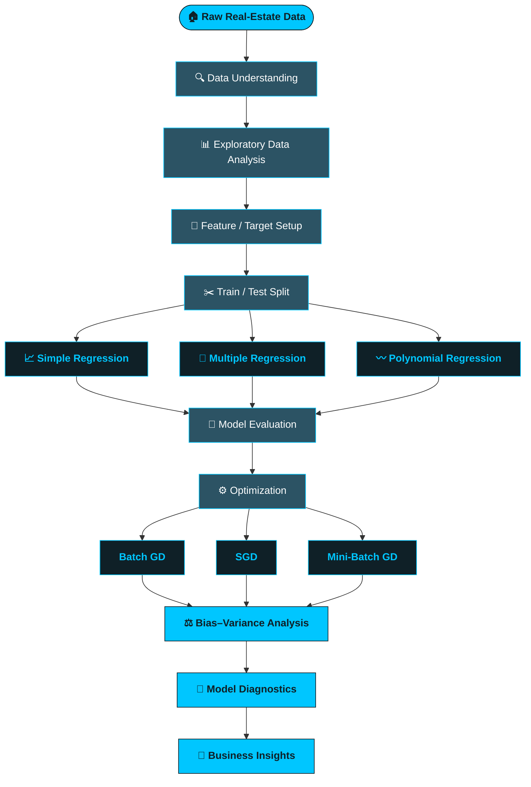
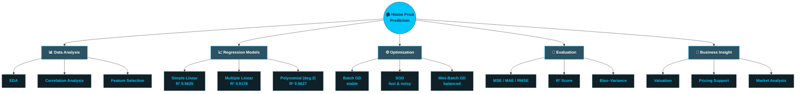
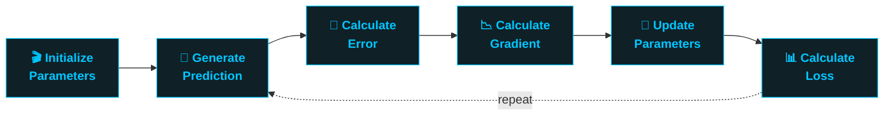
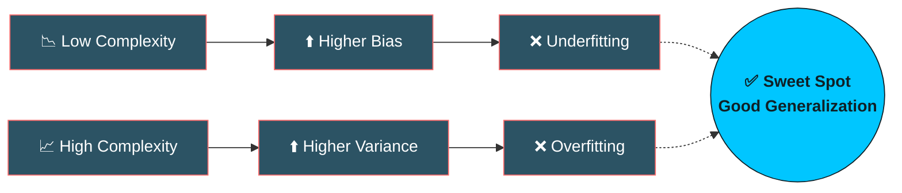

<div align="center">


<br/>

[](https://www.python.org/)
[](https://pandas.pydata.org/)
[](https://numpy.org/)
[](https://scikit-learn.org/)
[](https://jupyter.org/)
[](#-license)

<br/>


</div>

<p align="center">
  <em>A complete, from-scratch machine learning pipeline that predicts Indian real-estate prices (INR),
  compares three regression strategies, and implements three Gradient Descent optimizers by hand
  to reveal exactly how models learn.</em>
</p>


<br/>

## 📑 Table of Contents

<table>
<tr>
<td width="33%" valign="top">

**🎯 Foundations**
- [Project Overview](#-project-overview)
- [Objective](#-objective)
- [Dataset](#%EF%B8%8F-dataset)
- [Architecture Flow](#-project-architecture)
- [Concept Mind Map](#-concept-mind-map)

</td>
<td width="33%" valign="top">

**📈 Modeling**
- [Exploratory Data Analysis](#-exploratory-data-analysis)
- [Simple Linear Regression](#-model-1--simple-linear-regression)
- [Multiple Linear Regression](#-model-2--multiple-linear-regression)
- [Polynomial Regression](#%EF%B8%8F-model-3--polynomial-regression)
- [Model Comparison](#-model-performance-comparison)

</td>
<td width="33%" valign="top">

**⚙️ Optimization & Insight**
- [Gradient Descent](#%EF%B8%8F-gradient-descent-optimization)
- [Bias–Variance](#%EF%B8%8F-biasvariance-analysis)
- [Diagnostics](#-overfitting--underfitting-diagnostics)
- [Business Interpretation](#-business-interpretation)
- [Getting Started](#-getting-started)

</td>
</tr>
</table>

<br/>

## 🚀 Project Overview

This project presents a **complete Machine Learning regression workflow** for predicting real-estate house prices in INR.

Instead of relying on a single algorithm, the project systematically studies **how model complexity affects prediction performance** and **how optimization strategy affects training behavior** — from a one-feature baseline all the way to a fully optimized multi-feature model, with gradient descent built entirely from scratch.

<table>
<tr>
<td width="50%" valign="top">

**🔎 What this project covers**
- 📊 Data exploration & relationship analysis
- 🎯 Feature and target selection
- ✂️ Train / test methodology
- 📈 Simple Linear Regression
- 🧠 Multiple Linear Regression
- 〰️ Polynomial Regression

</td>
<td width="50%" valign="top">

**⚙️ Optimization & Diagnostics**
- ⚙️ Batch Gradient Descent (from scratch)
- ⚡ Stochastic Gradient Descent (SGD)
- 🚀 Mini-Batch Gradient Descent
- 📏 MSE · MAE · RMSE · R² evaluation
- ⚖️ Bias–variance analysis
- 🔬 Overfitting / underfitting diagnostics

</td>
</tr>
</table>

<br/>

## 🎯 Objective

> **How accurately can house prices be predicted from property characteristics, and how does model complexity affect prediction performance?**

The project also demonstrates the fundamentals behind optimization by implementing **Gradient Descent manually** — no black-box `.fit()` for the optimization study.

<br/>

## 🗂️ Dataset

<div align="center">

| 📌 Metric | Value |
|:--|:--:|
| **Rows** | 4,200 |
| **Columns** | 12 |
| **Missing Values** | 0 ✅ |
| **Duplicate Rows** | 0 ✅ |
| **Target Variable** | `house_price_inr` 🎯 |
| **Identifier (excluded from modeling)** | `house_id` |

</div>

<details>
<summary><b>📋 Click to expand full feature schema</b></summary>

<br/>

| Feature | Description |
|---|---|
| `house_id` | Unique house identifier |
| `area_sqft` | House area in square feet |
| `bedrooms` | Number of bedrooms |
| `bathrooms` | Number of bathrooms |
| `location_score` | Location quality score |
| `age_years` | Age of the property |
| `distance_city_km` | Distance from the city |
| `lot_size_sqft` | Lot / plot size |
| `has_garage` | Garage availability |
| `has_pool` | Pool availability |
| `renovation_years_ago` | Years since renovation |
| `house_price_inr` | 🎯 **Target** — House price |

</details>

<br/>

## 🧠 Project Architecture



<br/>

## 🧩 Concept Mind Map



<br/>

## 🔬 Exploratory Data Analysis

Correlation analysis revealed several variables with meaningful relationships to house price.

<table>
<tr>
<td valign="top" width="50%">

**🟢 Strongest Positive Correlations**

| Feature | Correlation |
|---|:--:|
| `area_sqft` | `0.755` |
| `bedrooms` | `0.645` |
| `location_score` | `0.589` |
| `lot_size_sqft` | `0.568` |
| `bathrooms` | `0.527` |

</td>
<td valign="top" width="50%">

**🔴 Negative Correlations**

| Feature | Correlation |
|---|:--:|
| `distance_city_km` | `-0.469` |
| `age_years` | `-0.089` |
| `renovation_years_ago` | `-0.037` |

</td>
</tr>
</table>

> **🔑 Key Finding**
> `area_sqft` has the strongest individual correlation with `house_price_inr`. The negative correlation with `distance_city_km` indicates that, within this dataset, houses farther from the city tend to have lower prices.
>
> *Note: Correlation describes association — it does not establish causation.*

<br/>

## 📈 Model 1 — Simple Linear Regression

**Approach:** Uses only `area_sqft → house_price_inr` as a baseline for comparison.

<div align="center">

| Metric | Result |
|:--:|:--:|
| **R²** | `0.5625` |
| **MAE** | `₹6,294,594` |
| **RMSE** | `₹8,184,697` |

`Fit: ██████████░░░░░░░░░░ 56.3%`

</div>

**Interpretation:** House area alone explains a meaningful portion of price variation, but a single feature cannot capture every factor driving property prices.

<br/>

## 🧠 Model 2 — Multiple Linear Regression

**Approach:** Uses all relevant predictive features simultaneously.

<div align="center">

| Metric | Result |
|:--:|:--:|
| **R²** | `0.9178` 🏆 |
| **MAE** | `₹2,604,991` |
| **RMSE** | `₹3,548,650` |

`Fit: ██████████████████░░ 91.8%`

</div>

**Key Finding:** Substantially improves test performance over the single-feature baseline — the model explains **~91.8%** of house price variation in the test set, with much lower MAE and RMSE.

<br/>

## 〰️ Model 3 — Polynomial Regression

**Approach:** A degree-2 polynomial model tests whether a curved relationship between area and price improves performance.

<div align="center">

| Metric | Result |
|:--:|:--:|
| **R²** | `0.5627` |
| **MAE** | `₹6,292,395` |
| **RMSE** | `₹8,183,089` |

`Fit: ██████████░░░░░░░░░░ 56.3%`

</div>

**Interpretation:** For this dataset and single-feature degree-2 setup, results are almost identical to Simple Linear Regression — a quadratic term on `area_sqft` alone doesn't match the benefit of adding more relevant features.

<br/>

## 🏆 Model Performance Comparison

<div align="center">

| Model | Test R² | Test MAE | Test RMSE | Visual Fit |
|---|:--:|:--:|:--:|:--|
| Simple Linear Regression | `0.5625` | ₹6.29M | ₹8.18M | `██████████░░░░░░░░░░` |
| **Multiple Linear Regression** 🏆 | **`0.9178`** | **₹2.60M** | **₹3.55M** | `██████████████████░░` |
| Polynomial Regression (deg 2) | `0.5627` | ₹6.29M | ₹8.18M | `██████████░░░░░░░░░░` |

</div>

> **📌 Result:** Among the tested models, **Multiple Linear Regression** achieved the strongest test performance — it combines multiple relevant property characteristics instead of relying on house area alone.

<br/>

## ⚙️ Gradient Descent Optimization

Gradient Descent was implemented **from scratch** to understand how model parameters are optimized by iteratively reducing loss.

<div align="center">

| Method | Update Data | Behavior |
|---|---|---|
| 🧠 **Batch GD** | Entire training dataset | Smooth and stable |
| ⚡ **SGD** | One observation | Fast, noisy updates |
| 🚀 **Mini-Batch GD** | Small groups | Balance of stability & speed |

</div>

### 🔄 Optimization Cycle



### 📏 Feature Scaling

Feature scaling was applied before Gradient Descent since features vary widely in numerical range — this helps GD make **more stable and efficient** parameter updates.

### 📉 Convergence Behavior

<table>
<tr><td width="33%" align="center">

**Batch GD**
Uses the full training set per update.
`Smooth & stable convergence`

</td><td width="33%" align="center">

**SGD**
Updates on one observation at a time.
`Fast but fluctuating loss`

</td><td width="33%" align="center">

**Mini-Batch GD**
Updates on small groups.
`Stability + frequent updates`

</td></tr>
</table>

> Training-time comparisons are experiment-specific and depend on epochs, batch size, learning rate, and hardware.

<br/>

## ⚖️ Bias–Variance Analysis

Model complexity directly affects the balance between bias and variance.



<table>
<tr>
<td width="33%" valign="top">

**📉 Simple Linear Regression**
- Low complexity
- One predictor only
- May miss key relationships
- More prone to underfitting

</td>
<td width="33%" valign="top">

**🧠 Multiple Linear Regression**
- Uses several predictors
- Captures more information
- Reduces single-feature limits
- Needs good feature selection

</td>
<td width="33%" valign="top">

**〰️ Polynomial Regression**
- More flexible
- Models non-linear relations
- Higher degree = more complexity
- Risk of overfitting rises

</td>
</tr>
</table>

<br/>

## 🔬 Overfitting & Underfitting Diagnostics

<table>
<tr>
<td width="50%" valign="top">

**⚠️ Underfitting — possible signs**
- High training error
- High testing error
- Model too simple for the pattern

</td>
<td width="50%" valign="top">

**⚠️ Overfitting — possible signs**
- Very low training error
- Much higher testing error
- Large train/test performance gap

</td>
</tr>
</table>

**Model Complexity Principle:** the goal is a model that **generalizes well to unseen data** — balanced between bias and variance.

<br/>

## 💼 Business Interpretation

A house-price prediction system can support real-world real-estate decision making.

<table>
<tr><td width="20%" align="center">🏡<br/><b>Property Valuation</b><br/><sub>Estimate prices from measurable characteristics</sub></td>
<td width="20%" align="center">💰<br/><b>Pricing Support</b><br/><sub>Data-driven reference for evaluating prices</sub></td>
<td width="20%" align="center">📊<br/><b>Market Analysis</b><br/><sub>Identify features strongly tied to price</sub></td>
<td width="20%" align="center">🏢<br/><b>Investment Analysis</b><br/><sub>Compare properties with estimated prices</sub></td>
<td width="20%" align="center">📈<br/><b>Decision Support</b><br/><sub>Combine predictions with local market context</sub></td>
</tr>
</table>

> ⚠️ **Important:** ML predictions are decision-support estimates, **not guaranteed market values**.

<br/>

## 📏 Evaluation Metrics Glossary

| Metric | Meaning |
|---|---|
| **MSE** | Mean Squared Error — average squared prediction error |
| **MAE** | Mean Absolute Error — average absolute prediction error, in INR |
| **RMSE** | Root Mean Squared Error — error in target units, penalizes large errors more |
| **R²** | Proportion of target variation explained by the model |

**Interpretation:** Lower MAE / RMSE → better accuracy · Higher R² → stronger explanatory power.

<br/>

## 📊 Project Visualizations

- 📈 Feature vs. House Price scatter plots
- 🔥 Correlation heatmap
- 📉 Regression line visualization
- 〰️ Polynomial regression curve
- 📊 Model performance comparison
- ⚙️ Gradient Descent convergence plots
- 🔬 Training vs. testing diagnostics

<br/>

## 📦 Project Deliverables

<table>
<tr>
<td width="50%" valign="top">

- 📓 Jupyter Notebook
- 📄 Dataset
- 📊 Exploratory Data Analysis
- 📈 Regression models

</td>
<td width="50%" valign="top">

- ⚙️ Gradient Descent implementations
- 📏 Model evaluation results
- 📉 Convergence visualizations
- ⚖️ Bias–variance + diagnostics + business interpretation

</td>
</tr>
</table>

<br/>

## 🛠️ Technologies Used

<div align="center">


**Core Concepts:** `EDA` `Regression` `Simple Linear Regression` `Multiple Linear Regression` `Polynomial Regression` `Gradient Descent` `Batch GD` `SGD` `Mini-Batch GD` `Feature Scaling` `MSE` `MAE` `RMSE` `R²` `Bias-Variance` `Overfitting` `Underfitting`

</div>

<br/>

## 🌟 Key Learning Outcomes

<table>
<tr>
<td width="50%" valign="top">

- ✅ Regression problem formulation
- ✅ Feature & target selection
- ✅ Exploratory data analysis
- ✅ Train / test methodology
- ✅ Linear, multiple & polynomial regression
- ✅ Model evaluation & feature scaling

</td>
<td width="50%" valign="top">

- ✅ Gradient-based optimization
- ✅ Gradient Descent from scratch
- ✅ Convergence behavior
- ✅ Bias–variance trade-off
- ✅ Overfitting & underfitting diagnosis
- ✅ Business interpretation of ML predictions

</td>
</tr>
</table>

<br/>


<details>
<summary><b>📁 Suggested project structure</b></summary>

<br/>

```
house-price-prediction/
PDF/
│   └── Theory.pdf
├── data/
│   └── house_prices.csv
├── notebooks/
│   └── house_price_prediction.ipynb
└── README.md
```

</details>

<br/>

## 🏁 Final Conclusion

This project demonstrates that **model choice and feature selection strongly influence regression performance**.

- The **Simple Linear Regression** model provides a useful baseline using house area alone.
- The **degree-2 Polynomial** model adds non-linearity, but in this experiment performs nearly identically to the simple baseline.
- The **Multiple Linear Regression** model achieved the strongest test performance among all three approaches — **R² ≈ 0.9178**, **MAE ≈ ₹2.60M**, **RMSE ≈ ₹3.55M**.
- The **Gradient Descent** experiments give practical insight into how model parameters are optimized, and how Batch, Stochastic, and Mini-Batch approaches differ in convergence behavior.

<div align="center">

```
Data → Exploration → Modeling → Optimization → Evaluation → Diagnostics → Business Insight
```

</div>

<br/>

## 👨‍💻 Author

<div align="center">

### Roshan Marathe
**Data Science · Data Analytics · Machine Learning · Python**

*This project was developed as a practical demonstration of data preprocessing, feature engineering, and analytical thinking using a realistic ride-hailing business scenario.*

<sub>⬇️ update these links with your real profiles before publishing</sub>

[](https://github.com/RoshanMarathe)
[](https://www.linkedin.com/in/roshan-marathe-960748358/)
[](mailto:roshanmarathe79@gmail.com)

</div>

## ⭐ Support This Project

<div align="center">

If you found this project useful, please consider giving it a **star** — it helps a lot!

**🏠📊 Real Estate House Price Prediction**
*Machine Learning • Regression • Optimization • Diagnostics*

</div>
